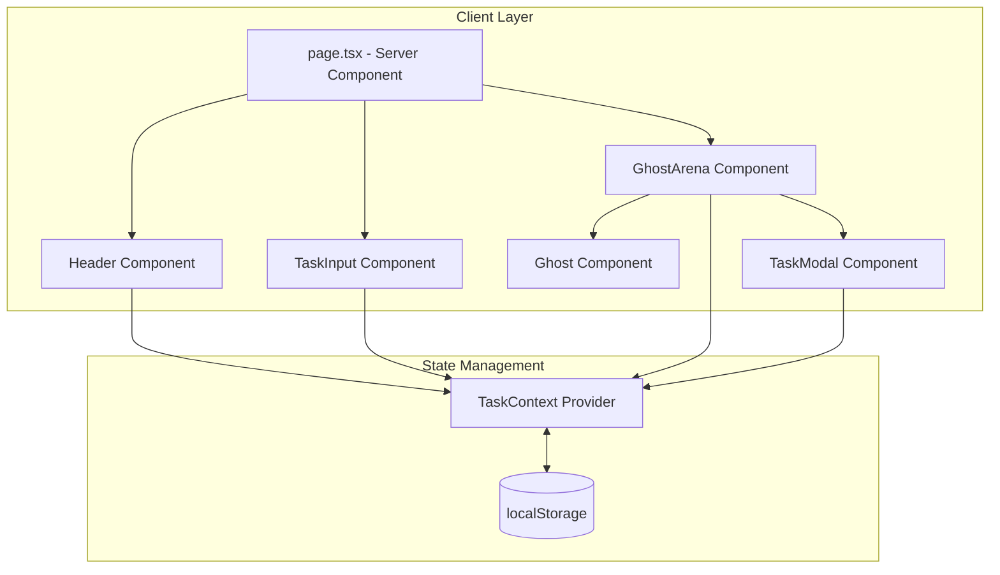

# Design Document

## Overview

Marley's Ledger is a Next.js application built with React and TypeScript that provides a themed todo experience. The application uses a component-based architecture with React Context for state management and localStorage for persistence. The visual design features floating ghost animations using CSS keyframes, with ghosts orbiting around the central UI elements.

## Architecture



## Components and Interfaces

### Page Component (Server)

- Entry point that composes Header, TaskInput, and GhostArena
- No client-side state

### Header Component

- Displays application title "Marley's Ledger"
- Shows soul counter (saved and lost counts)
- Consumes TaskContext for soul counts

### TaskInput Component

- Text input with submit button
- Handles task creation via TaskContext
- Validates non-empty input before submission

### GhostArena Component

- Container for all Ghost components
- Manages selected task state for modal
- Renders TaskModal when a ghost is selected

### Ghost Component

- Visual representation of a task
- Calculates orbital position based on index and total count
- Handles click to trigger task selection

### TaskModal Component

- Modal dialog for task editing
- Displays editable task title
- Lists subtasks with checkboxes
- Provides "Saved Soul" and "Lost Soul" action buttons

### TaskContext

- React Context providing global state
- Manages tasks array, savedSouls, and lostSouls counts
- Provides actions: addTask, updateTask, deleteTask, addSubtask, toggleSubtask, completeTask
- Handles localStorage persistence

### SoulScale Component (New)

- SVG-based weighing scale graphic
- Calculates tilt angle based on savedSouls vs lostSouls ratio
- Animates tilt transitions using CSS transforms
- Displays above the soul counter in Header

### GhostChains Component (New)

- SVG chain graphics that wrap around Ghost component
- Shows intact chains when task has incomplete subtasks
- Shows broken/falling chains when all subtasks complete
- Hidden when task has no subtasks

### SpiritConsultation Component (New)

- Secondary input section below TaskInput
- "Consult the Spirits" themed input with mystical styling
- Sends requests to AI API endpoint
- Displays suggested tasks in a preview list
- Accept/Dismiss buttons for each suggestion
- Loading state with spooky animation

### AI API Route (New)

- Next.js API route at /api/spirits
- Accepts POST with goal description
- Calls AI service (configurable provider)
- Returns array of suggested task strings
- Handles errors gracefully

## Data Models

### Task

```typescript
interface Task {
  id: string // Unique identifier (timestamp-based)
  title: string // Task description
  completed: boolean // Completion status
  subtasks: Subtask[] // Array of subtasks
  createdAt: number // Creation timestamp
}
```

### Subtask

```typescript
interface Subtask {
  id: string // Unique identifier
  title: string // Subtask description
  completed: boolean // Completion status
}
```

### Persisted State

```typescript
interface PersistedState {
  tasks: Task[]
  savedSouls: number
  lostSouls: number
}
```

## Correctness Properties

_A property is a characteristic or behavior that should hold true across all valid executions of a system-essentially, a formal statement about what the system should do. Properties serve as the bridge between human-readable specifications and machine-verifiable correctness guarantees._

### Property 1: Adding valid task grows task list

_For any_ task list and _for any_ non-empty, non-whitespace task description, adding the task should result in the task list length increasing by exactly one, and the new task should have the provided description.
**Validates: Requirements 1.1**

### Property 2: Empty/whitespace tasks are rejected

_For any_ task list and _for any_ string composed entirely of whitespace (including empty string), attempting to add it should leave the task list unchanged.
**Validates: Requirements 1.2**

### Property 3: Task persistence round-trip

_For any_ valid task object, serializing to JSON and then deserializing should produce an equivalent task object with all properties preserved (id, title, completed, subtasks, createdAt).
**Validates: Requirements 1.4, 7.4, 7.5**

### Property 4: Ghost orbital distribution

_For any_ number of ghosts N > 0 and _for any_ ghost at index i, the base angle should be (360 / N) \* i degrees, ensuring even distribution around the orbit.
**Validates: Requirements 2.2**

### Property 5: Task update persistence

_For any_ existing task and _for any_ new valid title, updating the task title should persist the change such that reloading returns the updated title.
**Validates: Requirements 3.3**

### Property 6: Adding subtask grows subtask list

_For any_ task and _for any_ non-empty subtask description, adding the subtask should increase the task's subtask count by exactly one.
**Validates: Requirements 4.1**

### Property 7: Subtask toggle inverts completion

_For any_ subtask with completion status S, toggling the subtask should result in completion status !S.
**Validates: Requirements 4.3**

### Property 8: Saving soul removes task and increments saved count

_For any_ task list with N tasks and saved count S, completing a task as "saved" should result in N-1 tasks and saved count S+1.
**Validates: Requirements 5.1**

### Property 9: Losing soul removes task and increments lost count

_For any_ task list with N tasks and lost count L, completing a task as "lost" should result in N-1 tasks and lost count L+1.
**Validates: Requirements 5.2**

### Property 10: Full state persistence round-trip

_For any_ application state (tasks array, savedSouls, lostSouls), persisting to localStorage and then restoring should produce an equivalent state.
**Validates: Requirements 5.4, 7.1, 7.2**

### Property 11: Scale tilt direction matches soul balance

_For any_ savedSouls count S and lostSouls count L, the scale tilt should be negative (left/saved side down) when S > L, positive (right/lost side down) when L > S, and zero when S == L.
**Validates: Requirements 8.2, 8.3, 8.4**

### Property 12: Chain visibility matches subtask state

_For any_ task with subtasks, chains should be visible if any subtask is incomplete, and broken/hidden if all subtasks are complete.
**Validates: Requirements 9.1, 9.2, 9.3**

## Error Handling

### Input Validation

- Empty or whitespace-only task descriptions are silently rejected
- Empty subtask descriptions are silently rejected

### localStorage Errors

- If localStorage is unavailable, the application continues with in-memory state only
- If stored data is corrupted/invalid JSON, initialize with empty state

### Missing Data

- If a task ID is not found during update/delete, the operation is a no-op
- If a subtask ID is not found during toggle, the operation is a no-op

## Testing Strategy

### Unit Testing

Unit tests will verify specific examples and edge cases:

- Task creation with various input types
- Modal open/close behavior
- Subtask checkbox interactions
- Soul counter display updates

### Property-Based Testing

Property-based tests will use **fast-check** library to verify universal properties:

- Each property test will run a minimum of 100 iterations
- Tests will be tagged with format: `**Feature: marleys-ledger, Property {number}: {property_text}**`
- Generators will create random valid tasks, subtasks, and state objects

**Property Test Coverage:**

1. Task addition invariant (Property 1)
2. Input validation (Property 2)
3. Serialization round-trip (Property 3)
4. Orbital calculation (Property 4)
5. Update persistence (Property 5)
6. Subtask addition (Property 6)
7. Toggle behavior (Property 7)
8. Save soul behavior (Property 8)
9. Lose soul behavior (Property 9)
10. Full state round-trip (Property 10)
